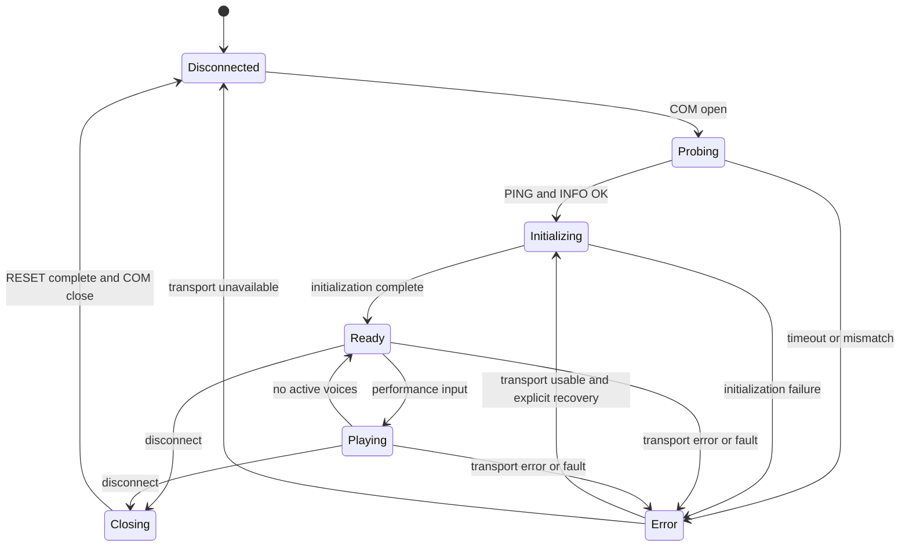

# NDSIF 外部シンセ用ホスト手順

文書版: 0.24 / Draft  
更新日: 2026-10-08  
対象: PC の人間によるリアルタイム演奏から NanoDrive8 を操作する UI / バックエンド

本書は現行 NDSIF v1 で構成できるホストの運用手順を定める。手順・UI・初期パラメータは新しいリアルタイムホスト向けの規約／設計案であり、現在の Delphi VGM アプリにすべて実装済みという意味ではない。追加のファームウェア変更は今回行わない。wire API は `NDSIF_API.md`、基礎仕様・検証記録は `NDSIF.md` を参照する。

## 1. VGM とリアルタイム入力の違い

ND8 の API は VGM に依存しない。VGM 特有なのは `NDSIFAudioVGM.pas` の入力解析・先読みであり、任意の音源エンジンで生成した YM2151 レジスタ列と ADPCM を送れる。

YMFM で既に動作している PC 音源の演奏入力・音色管理は、そのまま上流で使用する。ND8 出力バックエンドは、YM2151 レジスタ書き込みと必要なクロック設定を受け取り、NDSIF の要求へ変換する。PCM については PC 側で合成・必要なリサンプル・12bit 化・OKI ADPCM 化を行う。ND8 に MIDI / NoteOn / NoteOff / PCM8 チャンネルを直接送る API はない。

ソフトウェア音源の生成レートと物理 OKI のレートが異なる場合、ADPCM の前段で合わせる。出力エンコーダはチャンク・ノート・無音・PCM ソースの切替をまたいで維持する。元の ADPCM ブロックを切り替えただけで物理出力用エンコーダを初期化しない。VGM の入力側デコーダと物理出力用エンコーダは別の状態。

| プロファイル | 演奏 API | アイドル中の供給 | 用途 |
| --- | --- | --- | --- |
| FM のみ | 即時 `56` | PCM 不要。任意の定期 PING | 最小の送信待ちで YM2151 を操作 |
| FM + ADPCM、または共通の時間軸を使う FM | `58` と `59` | ゼロ PCM を連続 ADPCM 化して送る | FM・PCM のタイミングを合わせた外部シンセ |

FM のみの即時操作は PC / USB の到着タイミングで書き込まれる。連続プロファイルでは FM だけのノートも kind=0 で送り、無音 ADPCM を時間軸として動かせる。通常演奏で即時 `56` と予約済み kind=0 を混在させない。

## 2. ホスト状態と UI

「COM ハンドルを開けた」「NDSIF 応答を得た」「演奏可能」は分ける。本体の USB 接続表示を変更するものではなく、PC 側 UI の状態。

| 状態 | PC 側の意味 | 新しい演奏入力 | 送信内容 |
| --- | --- | --- | --- |
| 未接続 | COM を所有していない | ND8 へは送らない | なし |
| 接続確認中 | COM を開き機器・プロトコルを確認中 | ND8 入力を無効化 | PING、GET_INFO |
| 初期化中 | RESET・音色・クロック・事前供給 | ND8 入力を無効化 | RESET、設定、必要なら DATA / START |
| 待機（FM のみ） | 初期化済み、ADPCM 未開始 | 許可 | 通常はなし、監視 PING は任意 |
| 待機（連続） | START 済み、発音なし | 許可 | ゼロ PCM の DATA、低頻度 STATUS |
| 演奏中 | FM / PCM 音源が発音中 | 許可 | レジスタ／位置イベントと連続 DATA |
| 切断処理中 | 新規入力を止め、送信・音を終了 | 無効化 | 末尾処理、RESET |
| エラー／復旧中 | 接続または音源状態が不確定 | 無効化 | 可能なら診断、RESET、再初期化 |



Ready / Playing はホストの音源状態であり、ND8 の flags bit0 だけから発音中とは判断できない。入力が無効な間はキー状態を蓄積して復旧後に発音させず、離鍵状態へ戻す。UI からの COM 操作と送信・受信処理を同時に走らせない。

## 3. 接続・初期化手順

1. ND8 がシリアルモードで起動していることを前提に、対象 COM を開く。他アプリやシリアルモニターと同時に所有しない。現在の Hardware CDC と既存のファームウェア書き換え方式を維持する。
2. 受信処理と単一の送信所有者を開始する。任意の OS read 境界から COBS フレームを組み立て、opcode・要求番号・CRC を検証する。起動ログ・古い応答は演奏データとして解釈しない。
3. PING (`01`) で echo を確認。初期案は 1 秒 timeout、最大 3 回、新しい要求番号で再試行。COM open 成功だけで「接続済み」としない。
4. GET_INFO (`02`) で `NanoDrive 8` と FW 文字列を取得・表示する。プロトコル版とモデルが不一致なら初期化・演奏を中止する。
5. RESET (`00`) を送り、完了を待つ。前接続からの残音・ADPCM 故障・END・予約イベントを消す。ホストの出力エンコーダ、byte 位置、音色・発音管理、古い送信予定も新しいセッション用に初期化する。
6. 連続プロファイルの場合、AUDIO_STATUS (`5B`) の正常 payload 41 byte と RESET 後の状態を確認する。非対応なら ADPCM を開始しない。UI で FM のみへ切り替える場合は明示する。
7. SET_CHIP_CLOCK (`57`) で YM2151 クロックを設定し、`56` で音色と発音前の初期レジスタを送る。RESET は全音色を失うので、ホストの音色状態を再送する。OKI 初期 Hz / divider は START で指定できる。
8. FM のみの場合は PING を一度送り、先行する初期設定の処理完了を確認したら待機へ移る。
9. 連続プロファイルの場合は、先頭 5.12ms のゼロ PCM プリロールを含む無音を出力エンコーダで生成し、設定した先行量まで DATA を事前供給する。開始時の PAN は左右オン。必要な別 PAN はプリロール中の位置イベントとして予約する。
10. PING で初期レジスタと事前供給の処理完了を確認し、START (`5A`) を一方向送信する。START を送っただけでは受理確認にならない。通常の連続供給を続けつつ、開始後に一度 STATUS を非同期問い合わせし、fault=0・running=1 を確認して待機へ移る。未開始なら際限なく DATA を増やさず、初期化失敗として処理する。

ホスト内の「セッション」は状態管理上の区切り。現行 wire に session_id / ownership / HELLO はない。接続時の RESET は本書のホスト運用規約であり、COM を開いただけで ND8 が自動 RESET するわけではない。

## 4. アイドル中に何を送るか

| 状況 | 送るもの | 送らないもの |
| --- | --- | --- |
| 未接続 | なし | 全演奏要求 |
| RESET 後、ADPCM 未開始、FM のみ待機 | 必須の演奏データなし。監視するなら PING | 空の AUDIO_DATA、不要な START |
| ADPCM START 済み、ノートなし | PCM=0 を現在の出力状態で ADPCM 化した連続 DATA | ノートごとの END / RESET / 物理 STOP |
| PAN 両側オフ | 上と同じ連続 DATA | PAN オフを理由とした供給停止 |
| 正常 END 後、RESET 前 | ND8 が state に合う zero_pair を自律反復。必要なら STATUS | 追加 DATA / EVENT、同じ session の再 START |

現在の codec は符号付き 12bit（−2048～2047）で、ゼロ PCM は中点。符号なし 12bit の中点 2048 をそのまま encoder に入れない。エンコード後の最初の byte や遷移中の byte は固定値とは限らない。state が収束した後の `80` / `08` を一般的な無音コードとして無条件に挿入しない。`88` の反復も無音ではない。

VGM の PLAY 中の入力待ちで最後の予測値を保持する処理と、外部シンセに発音源がないときの PCM=0 は別。新しいホストでは、ミキサーが出力する実際の PCM を連続生成する。ノートが終わったら通常の音源の release を処理し、その後ゼロ PCM を供給する。

長いアイドルを END にして通信量を節約すると、次のノートで両チップ RESET・再設定・事前供給が必要になる。FM の残響・音色にも影響するため、リアルタイム用の通常待機には使わない。

## 5. リアルタイム演奏と先行量

現行 VGM テストの 80ms 先読みはファイル再生向け。人間の操作時刻に合わせて使うと、既に確定・送信した無音の後ろに新しい音を置くため、その先行量が主な操作遅延になる。初期案は次のとおり。新しいホストでの実測・検証が必要であり、既存 VGM アプリの値は変更しない。

| 項目 | リアルタイム用初期案 | 現行 VGM テスト |
| --- | --- | --- |
| チャンク時間 | 約 5ms（例: 8MHz/512 で 40 byte = 5.12ms） | 約 5.12ms |
| 事前供給・通常先行量 | 約 20ms。安定性確認後に 10ms 等も比較 | 80ms |
| 無音供給 | 接続中の連続プロファイルでは継続 | 曲中の無音を含めて継続 |
| 診断周期 | STATUS を約 250ms ごと、最大 1 件未完了 | 開始前・終了時 |
| FM のみの接続監視 | 必要なら PING 約 1 秒ごと | 起動同期等で使用 |

20ms だけで常に間に合う保証はない。Windows のスケジューリング・USB・FM 密度・画面更新で必要余裕が変わる。操作遅延は先行量に生成チャンクの丸め・入力／USB／制御タスクの遅れが加わる。接続直後に無音で開始して待機することで、最初の押鍵に handshake / START の待ちを加えない。

8MHz/512 の約 20ms は 157 byte = 20.096ms。4MHz/1024 では 40 byte = 20.48ms。4096 byte のリング容量を操作の先行量として使わない。約 5ms チャンクなら各レート 10～40 byte 程度であり、252 byte の API 上限とは別。

生成・送信は次の順序を保つ。

```text
演奏入力 / 音源更新
    ↓ 次の未生成・未確定区間へ反映
YM2151 レジスタ列 + 合成 PCM
    ↓ 現在の OKI sample rate へ変換
連続 ADPCM エンコード（前チャンクの state を継続）
    ↓ byte 境界に量子化
その区間の AUDIO_EVENT を昇順送信 → AUDIO_DATA を送信
```

新しいノートを既に送信済みの PCM の中へ挿入しない。現在の API は予約取消・PCM 置換がない。まだ未送信でも、後続を含めてエンコード済みの区間を差し替えるには codec state の巻戻しと再生成が必要。本書の初回手順では行わず、次の未生成区間へ反映する。

FM イベントの位置は ADPCM byte 数で指定する。同一位置の FM 組を最大125組までまとめる。イベントの受信順を維持し、対応 DATA より先に送る。ホストは DATA 末尾・生成末尾・送信キュー末尾・ND8 の accepted / played を区別する。PC の Enqueue 完了を「再生済み」と扱わない。

## 6. 送受信処理と長時間運用

演奏 DATA / EVENT / START にチャンクごとの ACK・確認・Drain は入れない。UI、音源生成、送信、受信・診断の待ちを分離する。すべてのフレームは一つの送信所有者から直列化し、複数スレッドの byte 列を混ぜない。

診断は受信処理を常時動かし、最大 1 件の制御要求を非同期で照合する設計とする。STATUS 応答待ち中も DATA の生成・送信を継続する。ND8 は応答を USB TX へ送り切るまで次の要求解析を待つため、ホストが応答を読まずに放置しない。故障通知の自発送信は現在ない。

現在の `TNDSIFSerialLink.Request()` は `Writer.Drain` 後に最大 1 秒待つ同期実装。音源供給と同じスレッドで繰り返し呼ぶと、20ms のバッファでも供給不足になり得る。新しい UI 用には受信常駐・非同期要求を実装する必要がある。既存の `TNDSIFSerialLink` に別スレッドから同時に Request を呼ぶだけの変更では対応できない。

連続 session では PC 時計と SI5351 の実周波数の差が蓄積する。現在の VGM テストの QPC だけによる pacing には閉ループ補正がなく、無期限の外部シンセ動作を検証済みとは扱わない。

新しいホストは STATUS の played を基準に再生位置の推定を補正し、pending とホスト側未完了 byte 数を含めた先行量を維持する設計とする。STATUS 間は PC の単調時計と現在のレートで進行を予測する。pending 単独ではホスト／OS 送信キュー内のデータを含まない。応答には本体 timestamp がなく、厳密な時刻同期はできない。

基準レート固定時は `pending_ms = pending_bytes × divider × 2000 / clock_hz`。レート変更を含む予約列では、各区間の時間を足し合わせる。位置付きクロック変更の適用遅れもあるため、最初の外部シンセ検証は固定レートで行う。制御タスクの遅れは late_events / max_event_lag で観測する。

補正のために ADPCM byte を途中で飛ばす・複製する・固定無音 byte を挿入することは禁止。出力 state がずれる。生成ペースやエンコード前のリサンプルを調整する方式を検討する。FM イベントキューの空き件数は取得できないため、無制限の先行予約を避け、生成するレジスタ密度も制限する。

## 7. 離鍵・全音停止・正常切断

通常の離鍵はホスト音源で NoteOff を処理し、FM キーオフのレジスタ列と PCM の release / ゼロ出力へ反映する。接続したまま待機に戻り、連続プロファイルの DATA 供給を維持する。離鍵ごとに RESET / END を送らない。

「全音停止」は二つの動作を分ける。通常の全離鍵は音源の release を認めたまま接続を維持する。緊急停止は生成・予約送信を止め、両チップ RESET を実行する。RESET だけを送り続ける入力の途中へ混ぜると、後続の古い NoteOn が再発音し得るため、新しい入力と古い送信予定を停止・破棄してから直列化する。

正常な切断・アプリ終了の手順:

1. 新規演奏入力を無効化し、接続 session の音源へ全離鍵を反映。送信済み区間の後ろへ終了処理を置く。
2. 連続プロファイルでは PCM をゼロへ戻し、現行 VGM と同じ 50ms のゼロ PCM 末尾をエンコード・送信する。最後の通常イベントを先に送り、最後の DATA の後ろに END を置く。
3. END は全予約イベント以上の位置かつ受理済み末尾で送る。エンコーダが収束した state に合う zero_pair を選ぶ。PCM / EVENT の追加を終了する。
4. STATUS の ended=1 を待つ。待ち時間は未再生先行量・末尾処理を含め、初期案として 1 秒の上限を置く。UI スレッドを止めて待たない。
5. RESET を最後の送信として実行し、完了を待つ。FM のみの場合も RESET で残音・音色状態を終了する。
6. 送信所有者と受信処理を停止し、COM を閉じる。ホストの note / codec / byte 位置 / 未完了要求を破棄し、未接続へ移る。

緊急停止では末尾・END 待ちを省略して RESET を使う。RESET 中は本体がミュートする。送信中の一つのフレームは byte 境界を保ち、RESET と割り込ませて混ぜない。既に OS へ渡した要求は wire 順に処理されるので、停止 latency はその残量にも依存する。

RESET 応答が得られない場合もアプリは無限待機しない。タイムアウトを表示して COM を閉じるが、「本体の音止め完了」とは表示しない。通信が失われていればソフトウェアから音止めを保証できない。

## 8. エラー処理と復旧

| 検出 | 現行本体の動作 | ホストの処理 |
| --- | --- | --- |
| COM open 失敗・別アプリ使用 | NDSIF 未開始 | 状態と OS エラーを表示、演奏無効 |
| PING / INFO 不一致・非対応版 | 初期化しない | 対象機器として扱わず切断 |
| 制御応答 timeout / CRC 不正応答 | 要求が処理済みか不明の場合あり | 接続不確定、演奏停止・復旧へ。単なる書き込み再送をしない |
| PCM 不足 | fault をラッチ、OKI を PAN ミュート | 診断保存、追加生成を止め、RESET・初期化 |
| PCM / EVENT / RX あふれ、位置拒否 | fault、OKI ミュート。RX 理由は counters=0 でも flags に出る | 原因表示・送信量／先行量修正、RESET・初期化 |
| played / accepted の予期しない巻戻り、開始未成立 | session 状態が不一致 | 古い codec / 予約を廃棄して再初期化 |
| イベント遅延のみ、fault=0 | 遅れて適用、統計増加 | 監視・評価。数値だけで即 RESET しない |
| WriteFile / ReadFile 失敗、USB 抜線 | COM close の確実な通知はない。給電も失う場合あり | UI を未接続／エラーへ、古い送信を廃棄。再接続時に handshake と RESET |

ADPCM fault 時も、即時 FM API は停止されず、FM が鳴り続け得る。ホストは故障を確認したら RESET で演奏全体を止める。低頻度監視から検出までの遅れは残る。本体側の自動 FM キーオフ・heartbeat lease は未実装。

通信が使える場合の復旧は、入力無効化 → 古い送信予定停止 → 可能なら STATUS 保存 → RESET 完了 → ホスト状態初期化 → クロック・音色再送 → 無音事前供給・START → 状態確認、の順。通信状態が不確定なら先に COM を閉じ、再接続手順へ戻る。古い ADPCM の続きを再送して復旧しない。

応答を失った RESET の自動再送は、演奏を維持したまま行わない。復旧状態で古い音源・予約をすべて終了させた後、新しい初期化として RESET を明示的に実行する。復旧後に押鍵を勝手に再発音させない。

故障ログは RESET 前に保存する。モデル・FW・profile・Hz / divider・accepted / played / pending・flags と理由・overflow 等・制御 timeout・ホスト未完了送信量を記録する。診断取得に失敗したら既に判明している OS エラー等だけを記録し、音止め要求を長時間遅らせない。

## 9. UI 実装前に残る項目

| 項目 | 現状 | 外部シンセでの扱い |
| --- | --- | --- |
| VGM / 任意データの共通化 | wire は共通。入力生成は VGM 専用 | YMFM 等からのレジスタ／PCM 出力アダプタを実装 |
| 非同期受信・制御要求 | Delphi の現行 Request は同期 | 供給を止めない要求・受信管理を実装 |
| 長時間のドリフト補正 | 現行 QPC pacing に補正なし | STATUS ベースの推定・生成 pacing を検証 |
| 操作 latency | VGM 80ms で検証 | 20ms 初期案で人間の演奏・高負荷を実測 |
| ホスト異常終了時の FM 音止め | 未実装 | 本体側 watchdog / session lease を今後設計 |
| 接続 ownership / 古いデータ識別 | wire session_id なし | 再接続 RESET、ホスト送信の単一所有。将来 API を検討 |
| END 後の無停止再開 | 不可、両チップ RESET が必要 | 通常待機では END を使わない |
| 一般 MUTE、ボリューム、個別 RESET | API なし | 現行 API にあると表示しない。追加設計対象 |
| バッファ能力・空きイベント数通知 | API なし | 現行容量と控えめな先行量で運用、将来通知を検討 |

VGM の良好な実機再生を、20ms リアルタイム・長時間連続運用・異常切断での自動音止めまで検証済みと解釈しない。初回の UI は固定レート・短時間の演奏から確認し、FM/PCM 同期、待機からの発音、連打、正常切断、復旧、長時間 pending の推移を順に評価する。
