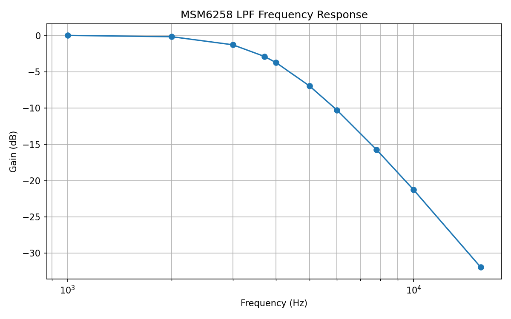

# Nano Drive 8 Firmware Development

Firmware development project for Nano Drive 8.

## Nano Drive 8 とは何？

Nano Drive 8 は、USB 電源だけで動くコンパクトな FM 音源 + ADPCM 音源再生キットです。MDX, VGM, VGZ フォーマットに対応しています。

### ハードウェア構成

- FM 音源: YM2151
- ADPCM 音源: OKI MSM6258
- 制御マイコン: ESP32-S3

### 設定オプション

| 項目 | 説明 |
| --- | --- |
| Language | 言語設定 |
| シャッフル | ランダム再生設定です。曲全体、カレントディレクトリ内だけを選択できます |
| PCM | ADPCMのフィルタ処理を選択します - RAWデータ: ファイル内のデータをそのまま送信 - 再サンプル: ADPCM を PCM に一旦解凍し DC 調整して再エンコードします  - 実機風フィルタ: 実機風のバンドパスフィルタを適用します |
| 曲ループ | 曲内のフレーズを何回ループするか指定します |
| リピート | 同じ曲や同じフォルダを繰り返し再生できます |
| スクロール | 画面のスクロールするラベルのスクロール回数を指定します |
| 起動時 | 起動したとき再生する曲を指定します |
| フェードアウト | フェードアウトの秒数を指定します |
| 再生ホールド | 曲選択時にすぐ再生せず、OKボタンを押すまで待機します |
| 出力増幅 | 視聴環境に応じて0 ~ 9dBを指定します |
| YM2151 パン | YM2151 の左右CHを入れ替えます |
| M6258 パン | OKIM6258 の左右CHを入れ替えます |
| LED明度 | チャンネルマスクのLEDの明るさを指定します |
| キーオン色 | ビジュアル表示のキーボードのキーオン色を指定します |
| キー割り当て | キーの割当を変更します セット1: 表示切り替え、ブラウザ、メニュー セット2: 次ディレクトリ、ブラウザ、メニュー |
| 画面方向 * | ビジュアル表示の向きを左向き右向きから選びます。要再起動 |

## 対応する MDX のいろいろな機能

- ADPCM バンク切り替え
- LZX 圧縮された MDX と PDX
- PCM1: ADPCM データを PDX からそのまま送信します。$E8 フラグがない場合は音量設定無視、$E8 があれば音量設定が反映されます
- PCM8/PCM8A: F0～F12 に対応します。ADPCM、16-bit PCM、8-bit PCM を 12-bit PCM に変換してミックスし、15.625kHz の ADPCM として実チップへ送信します。20.833kHz / 31.25kHz のデータは線形補間で 15.625kHz にダウンサンプリングします。処理の精度のため 15.625kHz が最も音質がよくなります。なお、F13 以降(PCM8++)には対応していません
- PCM8A ADPCM 音量設定: V0-15 と @v0-128 に対応。@v は一部解釈違いがあります。MPCM 互換 API による音程変換は未対応です（MDX 仕様不明）
- フェードアウト: TL はいじらずデジタルボリューム側で制御します。PCM も揃ってミュートされます
- MXDRV16y: 対応。テストは不完全なので正しく鳴らないものがあるかもしれません
- 実装は `portable_mdx` の処理を一部参照しています。さらに規格の拡張に合わせて再生できるようにさまざな改造をしています
- ADPCM のクロックは 8MHz と 4MHz に対応します

## VGM と ADPCM のポップノイズについて

一部ゲームの ADPCM データはオリジナルでも DC を中央に保持できいないものが存在します（あすか120％など）。このデータはドラムなどの音にブツブツ音が混ざります。

各実装ではおのおのの工夫により DC の急激な変化によるノイズを抑えているようです。本実装では 再サンプルモードにてハイパスフィルタ適用により DC 成分を除去しています。

## MDX の互換性について

予想外の動作をしたり再生できない MDX ファイルが一部存在しますのであらかじめご了承ください。歴史的経緯により MDX には様々な拡張、バリエーション、実装などが存在しており全て把握できていません。

もし、特定の MDX が鳴らないというお知らせを頂ける場合は、お手数ですがそのファイル、どの MDX 環境で鳴らすものか、本来どう鳴るかの参照物なども揃えていただけると大変助かります。また、お知らせをいただいても対応できる保証はできません。
作者はすでに燃え尽きています。

## ADPCM 処理について

### ステレオ化
- ADPCM ステレオはデジタルボリュームによって対応しています。実機のトランジスタを使った回路とは構成が異なります。

### フィルタリング設定

#### 1) RAWデータ
- VGM と MDX PCM1 では曲内データをそのまま ADPCM チップへ送信します。PCM8 では再エンコードとなります。

#### 2) 再エンコード
- ADPCM データを一旦 PCM に戻し、ミキシングと必要に応じて DC 除去を行い再エンコードします。ポップアップノイズをほぼ消すことができます。

#### 3) 実機風フィルタ
- 再エンコード時に実機風 ADPCM バンドパスフィルタ処理をソフトウェアで適用します。以下の周波数特性です。

### 実機風ハイパスフィルタ
 
 183Hz 1次

### 実機風ローパスフィルタ

Outside X68000 CZ-600CE コントロール回路図より導出

-  1kHz: 0.03dB
-  2kHz: −0.15dB
-  3kHz: −1.26dB
-  3.7kHz: −2.86dB
-  4kHz: −3.71dB
-  5kHz: −6.94dB
-  6kHz: −10.26dB
-  7.8125kHz: −15.73dB
-  10kHz: −21.27dB
-  15.625kHz: −31.94dB

## FAQ

- SDに入れられる最大曲数は?

  確認したかぎりでは安定動作するのは7,000曲くらいまでです。10,000曲はメモリが足りなくて危険です。あと起動時のスキャンが遅くなります。

- ある曲の再生が変なんですけど?

  別な MDX プレーヤーでも再生してみてください。ファイル自体が変なことが非常に多くあります。

- 実機のほうがあれがーこれがー

  実機でどうぞ。

## ライセンスについて

このリポジトリ内の自作コードは、特記がない限り BSD 3-Clause License で提供します。詳細は [LICENSE](LICENSE) を参照してください。

ただし、以下のファイルはこの BSD 3-Clause License の対象外です。

- `src/mdx.cpp`
- `include/mdx.h`

これらのファイルは `portable_mdx` を参考にしつつ、さらにそれ以前の歴史的な MXDRV/MDX 関連実装の流れを踏まえたロジックを含みます。
MDX 自体は X68000 時代の経緯を持つ形式であり、その周辺実装には権利関係が現代的な形で明文化されていないものが含まれるため、このリポジトリでは`mdx` 関連部分を再ライセンスしていません。

参考リポジトリ:
https://github.com/yosshin4004/portable_mdx

また、`src/okim6258.cpp` および `include/okim6258.h` には MAME の`okim6258` 実装に由来するロジックが含まれています。LZEXE 由来の展開ロジックを使用する箇所は、Fabrice Bellard 氏による MIT ライセンスのLZEXE オリジナルソースコードを根拠としています。これらはファイル内の表記および [license.txt](license.txt) の通知に従ってください。

その他の外部ライブラリ、フォント、および帰属表示については [license.txt](license.txt) を参照してください。

## License

Unless otherwise noted, the original source code in this repository authored for the Nano Drive project is licensed under the BSD 3-Clause License. See [LICENSE](LICENSE).

The following files are excluded from that BSD 3-Clause grant and remain subject to their original notices and upstream origins:

- `src/mdx.cpp`
- `include/mdx.h`

These files include logic derived from `portable_mdx` and other historical MXDRV/MDX-related sources. Their upstream rights history is not considered
sufficiently clear for relicensing by this repository, so they are excluded from the repository-level BSD 3-Clause grant.

Reference repository:
https://github.com/yosshin4004/portable_mdx

Some other files include code derived from third-party BSD/MIT-compatible sources. For example, `src/okim6258.cpp` and `include/okim6258.h` include logic derived from MAME's `okim6258` implementation and carry their own attribution notices. LZEXE-derived decompression logic, where used, is based on Fabrice Bellard's MIT-licensed original LZEXE source code.

Third-party libraries, fonts, and attribution notices used by this project are listed in [license.txt](license.txt).

## 謝辞

実装に必要な情報や不明な点についてヘルプをいただいた皆さま、ウェブサイト様に感謝いたします。

- [mxdrv@ウィキ](https://w.atwiki.jp/mxdrv/)
- [portalbe_mdx](https://github.com/yosshin4004/portable_mdx)
- Kappy さん
- X上で情報提供いただいた多くの方々

## バグMDXメモ
- PRO1.MDX: トラック7で28秒過ぎの音色指定 FD03 が間違って FF03 になってテンポが激遅になる。
